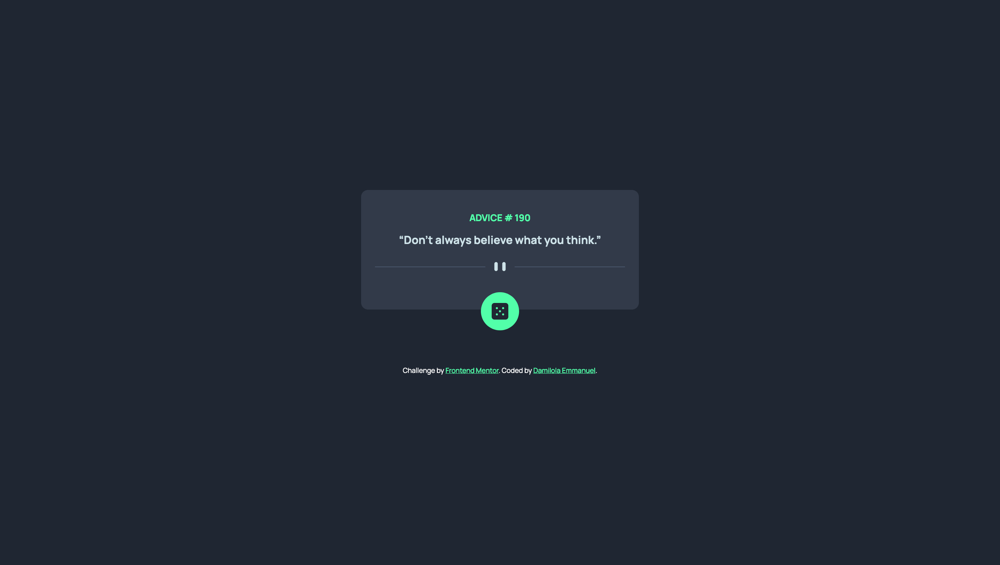

# Advice Generator App

This is a simple web application that generates random pieces of advice fetched from an external API. It features a responsive design and allows users to refresh the advice with the click of the dice button.



## Features

- Display of random advice fetched from an external API.
- Responsive layout using CSS media queries.
- Simple and intuitive user interface with a dice button to fetch new advice.

## Technologies Used

- HTML
- CSS
- JavaScript

## Setup

To run this project locally, follow these steps:

1. Clone the repository to your local machine:

   ```bash
   git clone https://github.com/Damilordz/advice-generator-app.git
   ```

2. Navigate into the project directory:
    ```
    cd advice-generator-app
    ```

3. Open the index.html file in your web browser.

4. Click the dice button to fetch new advice.

## Credits
- Challenge by [Frontend Mentor](https://www.frontendmentor.io/)